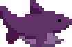

# Sharks and Minnows (digital-ocean)

 

Sharks and minnows meets a maze meets Mario Party meets socket.io. Originally created at HackBeanpot 2016.

[Demo, invite your friends!](http://sharksandminnows.xyz/)

##TODO
Create chat

- option to type (parse for expletives)
- option for emotes (5 options or so)

Code Refactor

- Consistant naming convention
- Remove bad code

Game Logic

- Points system
- Reset rounds
- Game objective?

Throttling

- Optimize refresh rates for more users
- Limit number of users

Game engine improvements (reference notes.txt)

- Add interpolation
- Delay from server
- Caching of location

##Feature branch instructions
- For major changes work on a feature branch
- Create a Pull Request when you want to merge
- Anyone is welcome to contribute :)

##Contributors
- Daniel Gorelick – [dqgorelick](https://github.com/dqgorelick)
- Huy Le – [huyle333](https://github.com/huyle333)
- Cheyan Setayesh – [Cheyans](https://github.com/Cheyans)
- Kaitlen Sousa – [k8sousa](https://github.com/k8sousa)
- Andy Shen – [heyletsmakeawish](https://github.com/heyletsmakeawish)
- Andrew Ton – [andrew-ton](https://github.com/andrew-ton)
- Chris DeLucia – [topher12093](https://github.com/topher12093)

##Music
- Simon Ton – [SoundCloud](https://soundcloud.com/simon_ton)
